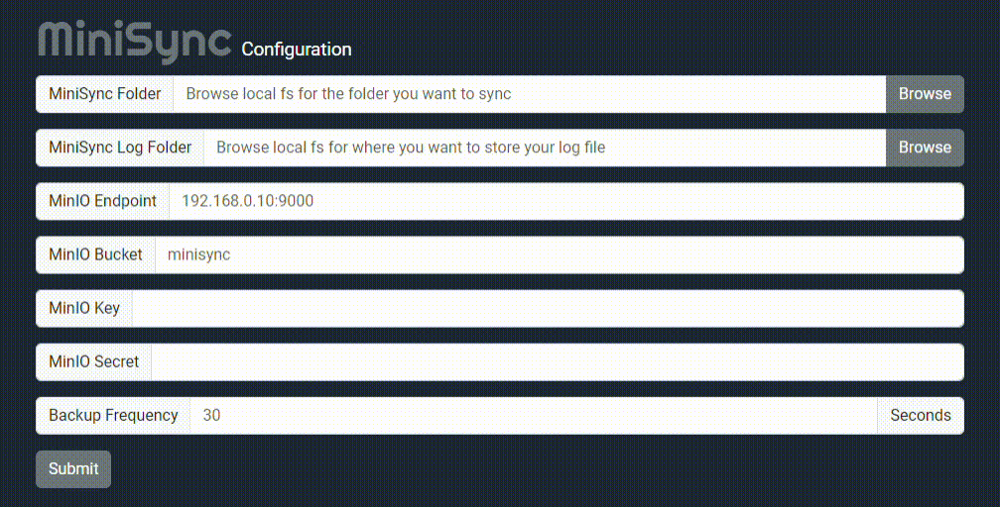
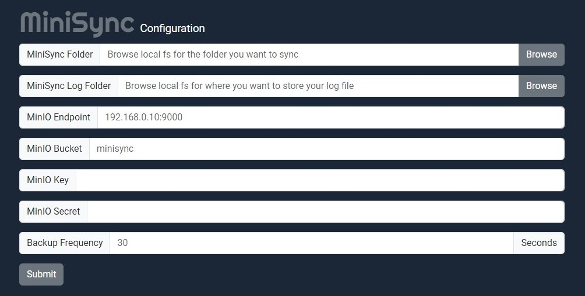
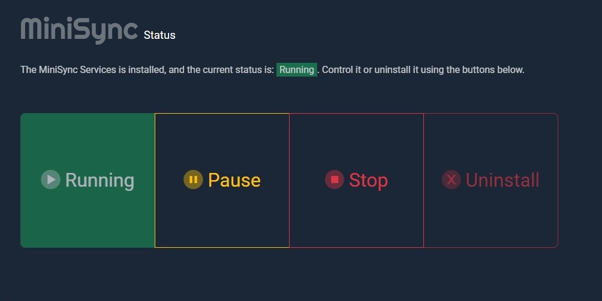

# MiniSync

This is a simple personal app I wrote for my home network. It made use of some concepts I haden't explored before such as managing Windows services, and an application GUI writting in [Wails](https://wails.io/), so I'm only making thie repository public in case people want to see how I integrated these concepts. **For more information, you can read my writeup on Medium [here](https://levelup.gitconnected.com/implementing-an-automated-file-backup-system-with-go-and-a-minio-cluster-a-pragmatic-approach-0ef4f047e9dc)**. In other words, this is not meant to be anything other than some implementation examples.

## Application Summary

MiniSync is a desktop application designed to manage and synchronize files between a local Windows system and a MinIO server. The application provides a user-friendly graphical interface (GUI) using the Wails framework, allowing users to configure synchronization settings, manage the service, and monitor its status in real-time. The underlying service, running as a Windows service, ensures that files in specified directories are automatically backed up to a MinIO server.



See: [MiniSync Configuration Options for details](./README.md#configuration)

## Installation

### Steps to Install

1. **Download the Application**: Obtain the latest release of the MiniSync application from the provided distribution link or build it from the source.
2. **Extract the Files**: Extract the downloaded ZIP file to a preferred location on your system.
3. **Install the Service**: Use the GUI to install the Windows service. This can be done by navigating to the "Service Management" section and clicking "Install."

## Running the application in dev mode

```bash
wails dev
```

## Building the App from Source

To build the MiniSync application from the source code, follow these steps:

1. **Build the Minisync Service Binary**:
   ```bash
   GOOS=windows GOARCH=amd64 go build -o bin/MiniSyncService.exe minisyncService/minisyncService.go
   ```
   This command compiles the `minisyncService.go` file into a Windows executable, `MiniSyncService.exe`. This binary will later be embedded into the main `MiniSync.exe` application.

2. **Build the MiniSync App**:
   ```bash
   wails build
   ```
   This command compiles the Go backend into a standalone Windows console application, `MiniSync.exe`. During this process, the `MiniSyncService.exe` binary is embedded within the `MiniSync.exe` file, allowing the main application to manage the service seamlessly.
   <br />
   Alternately, for debugging, you can keep the console window open with the `-windowsconsole` switch and open up the developer console tools for the front end with the `-debug` switch:

   ```bash
   wails build -windowsconsole -debug
   ```

3. **Running the Application**:
   - Once the build is complete, the output binary can be found in the `build/bin/` directory. Run the application by executing:
     ```bash
     ./build/bin/MiniSync.exe
     ```

## Running the Application

1. ~~**Launch the GUI**: Double-click the `MiniSync.exe` file to launch the application. The Wails-based GUI will open.~~
1. **Launch the GUI**: Right-click the `MiniSync.exe` and choose **'Run as Administrator'** to launch the application. Since this application installs and controls a Windows service, until I figure out if there is a way to run this with limited permissions, this will have to do.
2. **Start the Service**: In the GUI, go to the service management section and click "Start" to begin the synchronization service. The service will start monitoring the configured directories and syncing files to the MinIO server.
3. **Monitor Service Status**: The application provides real-time status updates, allowing you to monitor whether the service is running, stopped, or encountering any issues.

## Configuration

The configuration screen allows you to set up your sync preferences, such as the folders to monitor, MinIO server settings, and sync frequency. Below is an example configuration screen:



- **MiniSync Folder**: Select the local folder you want to sync with MinIO.
- **MiniSync Log Folder**: Choose where to store the log files for sync operations.
- **MinIO Endpoint**: Enter the URL of your MinIO server.
- **MinIO Bucket**: Specify the bucket name in MinIO where files will be stored.
- **MinIO Key**: Your access key for MinIO.
- **MinIO Secret**: Your secret key for MinIO.
- **Backup Frequency**: Set how often to check and synchronize the folder (in seconds).

## Service Management

You can manage the MiniSync service directly from the control panel:



- **Running**: Indicates that the service is currently active.
- **Pause**: Temporarily halt the service.
- **Stop**: Completely stop the service.
- **Uninstall**: Remove the service from your system.

Use these controls to start, stop, pause, or uninstall the service as needed.

## Troubleshooting and Common Issues

### Common Issues

1. **Service Not Starting**:
   - Ensure that the configuration is correct and that all necessary fields are filled out in the GUI.
   - Check the logs in the specified log folder for any errors.

2. **Service Not Stopping**:
   - If the service does not stop as expected, try using the "Uninstall" button to remove the service and then reinstall it.

3. **Debugging**:
   - You can check the service status outside of the application via the windows command line: `sc query Minisync`

4. **MinIO Connection Issues**:
   - Verify that the MinIO endpoint, access key, and secret key are correct and that the MinIO server is accessible.

### Additional Resources
- Refer to the MinIO setup guide for additional configuration tips: [MinIO Setup: README](MINIO_SETUP.md)
